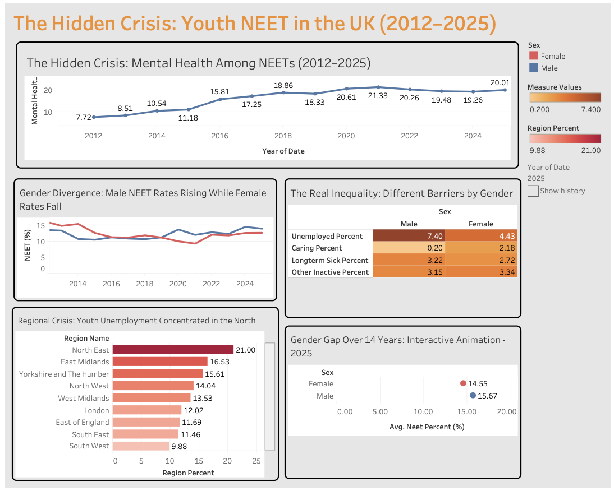

# UK Youth NEET Analysis (2012–2025)

An end-to-end data project exploring mental health, gender, and regional 
inequality among young people Not in Education, Employment or Training (NEET) in the UK.

**Tools used:** Excel · SQL · Tableau

---

## What I Did

1. **Cleaned** raw ONS quarterly NEET data in Excel
2. **Transformed** the data using SQL — filtering by year, gender, region, 
   and inactivity reason
3. **Visualised** the findings in a Tableau dashboard

---

## What the Data Tells Us

### 🧠 Mental Health Is Getting Worse — Even After Covid
Mental health issues among NEETs nearly tripled from 7.72% in 2012 to a 
peak of 21.33% in 2021. Even after Covid restrictions lifted, it only 
slightly dropped and remains at 20% in 2025.

This sustained rise likely reflects more than just the pandemic. The rapid 
growth of social media and AI may be contributing, young people face 
constant peer comparison online, and growing anxiety about automation 
replacing jobs in the future.

### ⚧️ Gender Gap: Same Problem, Different Reasons
Male NEET rates are rising while female rates are gradually falling, but 
the reasons behind each tell different stories.

Men are disproportionately NEET due to unemployment (7.40% vs 4.43% for 
women), while women are far more likely to be NEET due to caring 
responsibilities (2.18% vs just 0.20% for men). This reflects the reality 
many mothers face: childcare in the UK costs around 35% of an average 
couple's wages, one of the highest in the world, making it financially 
difficult to return to work when children are young.

Men also have a slightly higher long-term sickness rate (3.22% vs 2.72%), 
which may partly reflect the lasting health impact of Covid-19; long-term 
sickness across all ages surged post-pandemic and has been slow to recover.

### 🗺️ Where You're Born Still Shapes Your Chances
Regional inequality in youth unemployment is stark. The North East sits at 
21%, nearly double the South West at 9.88%.

Research consistently shows the North faces growing divides in job creation, 
productivity and educational outcomes. High-skilled industries remain 
concentrated in London and the South East, creating a pull effect that 
draws opportunity away from northern regions, leaving young people in the 
North East with fewer entry points into the labour market.

---

## Data Source

Data sourced from the ONS (Office for National Statistics) quarterly NEET 
dataset. Initial formatting and structural cleaning was performed in Excel 
before SQL transformation.

---

## Dashboard

